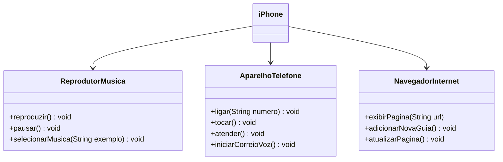

# Desafio DIO

Minha resolucao do desafio de modelar um Iphone com UML e com o adicional de fazer o codigo das classes e interfaces em java

### Modelo do Iphone em UML

```mermaid
classDiagram
    class ReprodutorMusica {
        +reproduzir() void
        +pausar() void
        +selecionarMusica(String exemplo) void
    }

    class AparelhoTelefone {
        +ligar(String numero) void
        +tocar() void
        +atender() void
        +iniciarCorreioVoz() void
    }

    class NavegadorInternet {
        +exibirPagina(String url) 
        +adicionarNovaGuia() void
        +atualizarPagina() void
    }

    class iPhone {
    }

    iPhone --> ReprodutorMusica
    iPhone --> AparelhoTelefone
    iPhone --> NavegadorInternet
```

